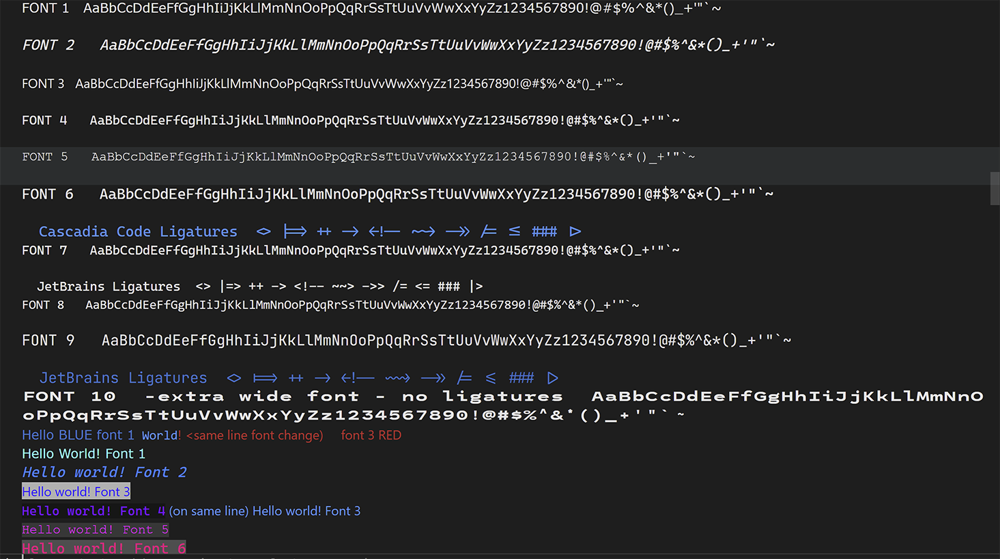

## VSCode

I have extended the support for ANSI SGR codes within VSCode to support essentially EVERY ANSI SGR code, and correspondingly every feature of Chalk'Dart.
These are now available in the release version of VSCode.  The font commands are also supported,
but currently you must add font-family definitions to the VSCode stylesheets using the
'Customize UI' extension.

When using VSCode it is possible to Enable full font support for the 10 fonts
by installing the extension "Customize UI" and adding the following to your VSCode settings.json
file.
For the value for each of these CSS selectors you place the font-family of the font you want to use,
and any other css font directives, such as font-style, font-weight, font-size, font-stretch, etc.
In the example below I have including using some common coding font.

Add these to VSCode settings.json, after enabling the "Customize UI" extension:

```json
    "customizeUI.stylesheet": {
        ".monaco-workbench .repl .repl-tree .output.expression .code-font-1" :
               "font-family: Verdana,Arial,sans-serif;",
        ".monaco-workbench .repl .repl-tree .output.expression .code-font-2" :
               "font-style: italic; font-size: 16px; padding: 0px; font-family: 'Cascadia Code PL';",
        ".monaco-workbench .repl .repl-tree .output.expression .code-font-3" :
               "font-family: 'Segoe WPC', 'Segoe UI';",
        ".monaco-workbench .repl .repl-tree .output.expression .code-font-4" : 
               "font-family: 'Cascadia Mono';",
        ".monaco-workbench .repl .repl-tree .output.expression .code-font-5" : 
               "font-family: 'Courier New', 'Courier', monospace;",
        ".monaco-workbench .repl .repl-tree .output.expression .code-font-6" : 
               "font-size: 16px; padding: 0px; font-family: 'Cascadia Code PL';",
        ".monaco-workbench .repl .repl-tree .output.expression .code-font-7" : 
               "font-family: 'Cascadia Mono PL';",
        ".monaco-workbench .repl .repl-tree .output.expression .code-font-8" : 
               "font-size: 14px; padding: 0px; font-family: 'Cascadia Code PL';",
        ".monaco-workbench .repl .repl-tree .output.expression .code-font-9" : 
               "font-size: 16px; font-family: 'JetBrains Mono';",
        ".monaco-workbench .repl .repl-tree .output.expression .code-font-10" : 
               "font-stretch: ultra-expanded; font-weight: bold; font-family: 'League Mono';",
    },
```

##Example screengrab from VSCode Debug Console
 
